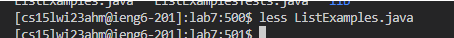
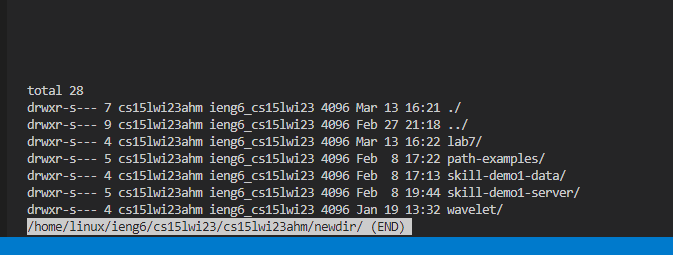
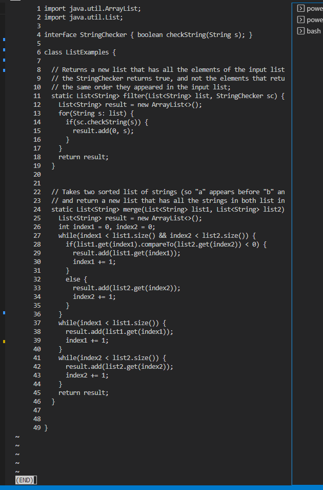
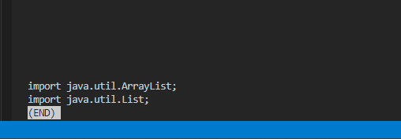
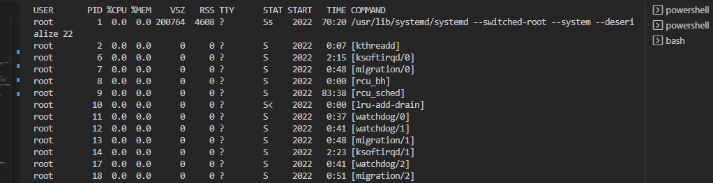

# Lab Rep 5 lab 3 version Less command

## less
```
 $ less [options] file_path
```

- Less is a command-line program that allows users to view the contents of a file one screenful at a time, providing various features for navigating and searching through the file.


###using less without any options

```
$ less ~/newdir/lab7/ListExamples.java 
```

- command above shows that a window of text pops up

###using less on a file that doesnt exist
```
$ less boogie.txt
```

- if used on a file that doesnt exist the command will return  "No such file or directory"

###using less with -f
```
$ less -f ~/newdir
```

- this allows for the opening of non text files such as directory and non-regular files


###using less with -N
```
$ less -Nf ~/newdir/lab7/ListExamples.java 
```

- N displays line numbers on the left side of the screen.


###using less with -S
```
$ less -NfS ~/newdir/lab7/ListExamples.java 
```

-S chops long lines instead of wrapping them.


###using less with grep
```
$ grep "import" ListExamples.java | less  
```

- searching for term in filename

###using less with grep
```
$ ps aux | less
```

- outputting all the current processes into less

